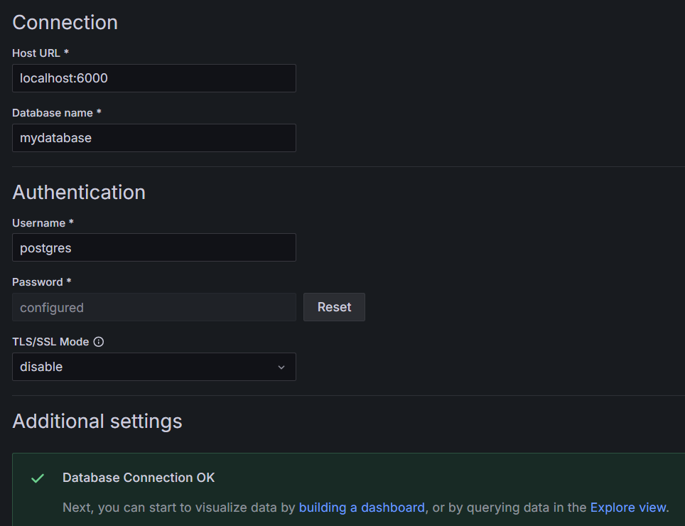

# PiEnviroNet
this app is for an ESP32 module to send data (main.cpp) for a light sensor to a database for later review!

## Components:
- Flask API
    - this server is the running entryway for the ESP32 module to send data to and have it stored in the postgres db

- Postgres DB
    - the data storage vehicle for the long term data
    - need to setup the following locally! (see init.sql)
    - if you want to run your database on an external HDD [HERE](https://dba.stackexchange.com/questions/283845/postgresql-on-external-hd) is a good resource on how to do that. just ensure the connection works as expected for the flask app in db_functions.py (get_connection())
    - also, if using a docker container with the below docker instructions be sure to have THIS repo where you want the data for the database as the volume library will be contained inside /flask-backend/data/

postgres db - mydatabase
user - postgres
pass - password

- ESP32/arduino
    - the module or sensor control board (see esp-code/main.cpp) to run the logic
        - all configuration should be at the top of the page, whats there is taylored to MY use case but it should be simple enough to change per-control board
        - ive configured the `ledOut` pin setting to be the on-board pin for my ESP module to act like a heartbeat of sorts. if its off or on forever something is probably wrong but if it blinks slowly its pretty safe to assume nothing is about to catch fire.
    - photoresistor (light sensor)
        - [DOCS](https://docs.sunfounder.com/projects/esp32-starter-kit/en/latest/arduino/basic_projects/ar_photoresistor.html)

    - Temp and humidity (DH11 chip)
        - [DOCS](https://docs.sunfounder.com/projects/esp32-starter-kit/en/latest/arduino/basic_projects/ar_dht11.html)
    - Temp, Pressure, altitude, humidity (BME680 chip)
        - [DOCS](https://randomnerdtutorials.com/esp32-bme680-sensor-arduino/)
- Grafana
    - `sudo /bin/systemctl start grafana-server`
    - `sudo /bin/systemctl status grafana-server` to ensure it is running
    - `http://<pis local ip>:3000`
    - default user-pass (admin-admin)
    - dont worry too much just setup a connection with `localhost:6000` and the application username and password
    
    - charting system available through local portal 
    - [DOCS](https://raspberrytips.com/install-grafana-raspberry-pi/)

## run flask app
`$ flask --app flask-backend/app run`

for running openly on local IP
`$ flask --app flask-backend/app run --host=0.0.0.0`

 ## RUNNING FLASK IN DOCKER
  [DOCS](https://raspberrytips.com/docker-on-raspberry-pi/)
  the benifits of this is so you can ssh in from a remote and see whats going on without having to disturb or run in any kind of debug mode

  first we need to setup docker, the above docs should help. then we need to execute the following

  - `docker ps` to see we have no running images
  - `cd flask-backend` to get to our flask directory
  - ` docker compose up -d` to build the docker-compose yaml this creates the postgres DB and flask application
  - `docker ps` to see the newly running image. you should be able to ping the `rasberrypi.local:8080` endpoint to see the welcome page in the flask app.
  - `docker compose down` to kill everything

  - `docker logs [image num]` to view logs
  - `docker stop [image num]` to kill the container

    - connect to the docker postgres with `psql -h localhost -p 6000 -U postgres` password postgres